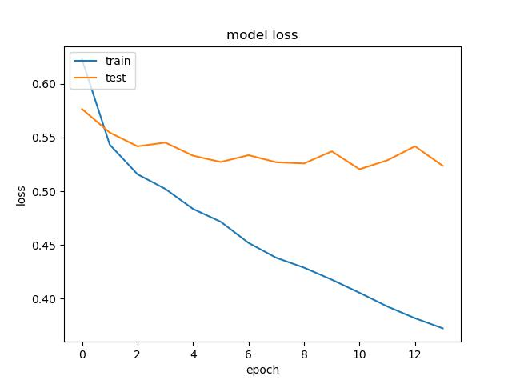

# Détection de Fractures Osseuses

## Introduction
Depuis longtemps, les fractures osseuses constituent un problème persistant pour l'humanité, et leur classification par radiographie a toujours dépendu du diagnostic humain, qui peut parfois être imparfait. Ces dernières années, les solutions basées sur l'apprentissage automatique et l'IA sont devenues une partie intégrante de nos vies, dans tous les aspects, ainsi que dans le domaine médical.

Dans le cadre de nos recherches et de notre projet, nous avons étudié cette problématique de classification et avons essayé, en nous basant sur des tentatives et recherches antérieures, de développer et d'affiner une solution viable pour le domaine médical en termes d'identification et de classification de diverses fractures osseuses, en utilisant des **réseaux neuronaux convolutifs (CNN)** dans le cadre de modèles modernes, tels que **ResNet, DenseNet, VGG16**, etc.

Après avoir effectué de multiples tentatives d'affinement de modèles pour différents modèles, nous avons obtenu des résultats de classification inférieurs au seuil de confiance prédéfini et convenu plus tard dans cette recherche. Cependant, avec les résultats prometteurs que nous avons obtenus, nous pensons que des systèmes de ce type, des solutions basées sur l'apprentissage automatique et l'apprentissage profond pour l'identification et la classification des fractures osseuses, avec un affinement supplémentaire et l'application de techniques plus avancées telles que l'**extraction de caractéristiques**, pourraient remplacer les méthodes traditionnelles actuellement utilisées dans le domaine médical, avec de bien meilleurs résultats.

---

## Jeu de données
Le jeu de données que nous avons utilisé s'appelle **MURA** et comprend 3 parties osseuses différentes. MURA est un jeu de données de radiographies musculo-squelettiques et contient 20 335 images décrites ci-dessous :

| **Partie** | **Normal** | **Fracturé** | **Total** |
|--------------|:----------:|-------------:|----------:|
| **Coude** |    3160    |        2236  |    5396   |
| **Main** |    4330    |        1673  |    6003   |
| **Épaule** |    4496    |        4440  |    8936   |

Les données sont séparées en ensembles d'entraînement (`train`) et de validation (`valid`), où chaque dossier contient un dossier de patient et pour chaque patient, entre 1 et 3 images pour la même partie osseuse.

---

## Algorithme
Nos données contiennent environ 20 000 images de radiographies, incluant trois types d'os différents : le coude, la main et l'épaule. Après avoir chargé toutes les images dans des *dataframes* et attribué une étiquette à chaque image, nous avons divisé nos images en 72 % pour l'entraînement, 18 % pour la validation et 10 % pour le test.

L'algorithme commence par l'**augmentation des données** et le **pré-traitement** des images radiographiques, comme le retournement horizontal. La deuxième étape utilise un réseau neuronal **ResNet50** pour classer le type d'os dans l'image. Une fois le type d'os prédit, un modèle spécifique sera chargé pour cette prédiction de type d'os parmi 3 types différents, chacun ayant été entraîné pour identifier une fracture dans un autre type d'os et utilisé pour détecter si l'os est fracturé.

Cette approche utilise les fortes capacités de classification d'images de ResNet50 pour identifier le type d'os, puis emploie un modèle spécifique pour chaque os afin de déterminer s'il y a une fracture. En utilisant ce processus en deux étapes, l'algorithme peut analyser efficacement et avec précision les images radiographiques, aidant les professionnels de la santé à diagnostiquer les patients rapidement et avec précision.

L'algorithme peut déterminer si la prédiction doit être considérée comme un résultat positif, indiquant la présence d'une fracture osseuse, ou un résultat négatif, indiquant l'absence de fracture osseuse. Les résultats de la classification du type d'os et de la détection de fracture osseuse seront affichés à l'utilisateur dans l'application, permettant une interprétation facile.

Cet algorithme a le potentiel d'aider grandement les professionnels de la santé à détecter les fractures osseuses et à améliorer le diagnostic et le traitement des patients. Son analyse efficace et précise des images radiographiques peut accélérer le processus de diagnostic et aider les patients à recevoir les soins appropriés.

---

## Résultats
### Prédiction de la partie du corps

 

### Détection de fracture
#### Coude

 

#### Main
 

#### Épaule
 

---

# Installations
### Python v3.7.x
### Installer `requirements.txt`

* `customtkinter~=5.0.3`
* `PyAutoGUI~=0.9.53`
* `PyGetWindow~=0.0.9`
* `Pillow~=8.4.0`
* `numpy~=1.19.5`
* `tensorflow~=2.6.2`
* `keras~=2.6.0`
* `pandas~=1.1.5`
* `matplotlib~=3.3.4`
* `scikit-learn~=0.24.2`
* `colorama~=0.4.5`
* `Flask==2.3.3`

Exécuter `app.py`

---

# Interface Graphique (GUI)
### Principale

### Test Normal & Fracturé
 